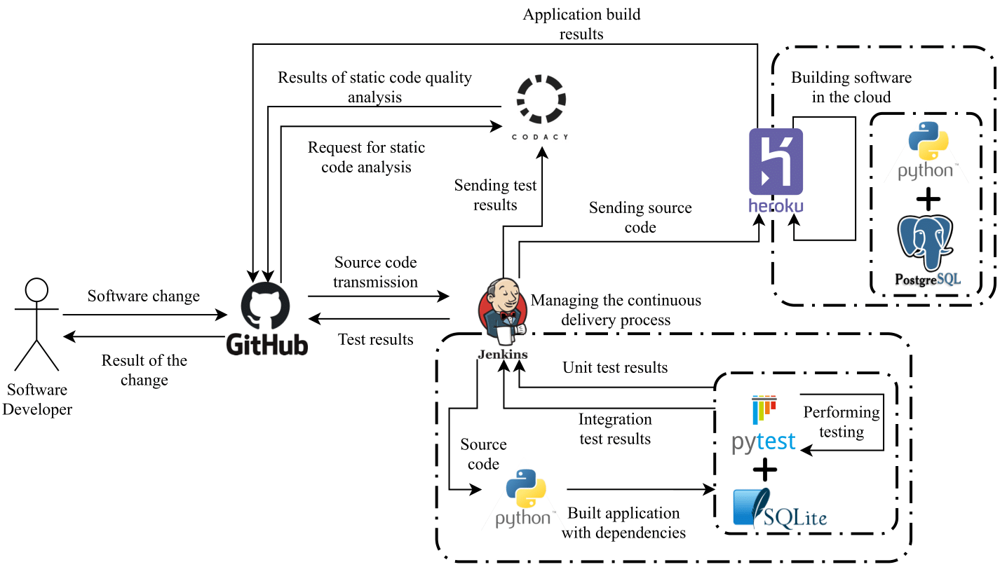

# IoT RESTfuf web service
### RESTful Webservice for managing IoT devices.

The goal of this project is to create a web service that stores data sent by hubs and serves as back-end for mobile and web application.

This project is part of IoT System. Other components in the system:
- A web application - [IoT-front](https://github.com/michalkoziara/IoT-front)
- A mobile application - [IoT-mobile](https://github.com/michalkoziara/IoT-mobile)

## Getting Started

These instructions will get you a copy of the project up and running on 
your local machine for development and testing purposes.

### Prerequisites

* Python [3.6+] - https://www.python.org/

Detailed information about installation and configurations are provided at developers' site.

## Technology Stack

* Python3
* Flask
* SQLAlchemy
* pytest
* JWT
* SQLite
* PostgreSQL

### Build 

A step by step instruction [on Windows 10]:
* Navigate to project directory in Command Prompt (cmd).
* Create database with latest migration file ``python manage.py db upgrade``
* Run `python manage.py run` to start application's local development server. 

The continuous delivery process is managed by Jenkins and the static analysis is performed by Codacy.

The default provider for the production environment is set to Heroku.

In order to distribute the application in a cloud environment, ``Jenkinsfile`` should be modified accordingly.

<table>
    <tr>
        <td>
            
Continous Delivery Pipeline

            
        </td>
    </tr>
</table>

## CLI commands

Create database migration file  
``python manage.py db migrate``

Update database with latest migration file   
``python manage.py db upgrade``

Run application  
``python manage.py run``

Print configured application routes  
``python manage.py get_routes``

Run all tests  
``python manage.py test``

Run unit tests  
``python manage.py test_unit``

Run integration tests  
``python manage.py test_integration``

Run all tests and generate coverage report in HTML format  
``pytest app/test/ --cov=. --cov-report=html --cov-branch --cov-config=.coveragerc --cache-clear``

Run unit tests and generate coverage report in HTML format  
``pytest app/test/unittest --cov=. --cov-report=html --cov-branch --cov-config=.coveragerc``

Run integration tests and generate coverage report in HTML format  
``pytest app/test/integrationtest --cov=. --cov-report=html --cov-branch --cov-config=.coveragerc --cache-clear``

## Authors

* **Michał Koziara** 
* **Piotr Kramek**
